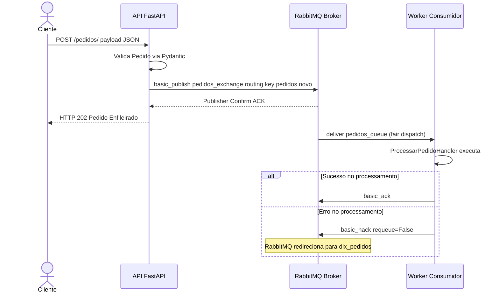

# 📚 Passo 1/6: Introdução à Arquitetura Orientada a Eventos (EDA) & DDD

Bem-vindo à jornada de construção de sistemas distribuídos robustos, Padawan! Neste primeiro passo, vamos compreender os alicerces teóricos e a visão arquitetural do projeto que você irá desenvolver sob minha mentoria.

---

## 🎯 O Cenário Real: Por que Mensageria Assíncrona?
Em sistemas monolíticos ou síncronos tradicionais (como APIs REST tradicionais de ponta a ponta), se o serviço A chama o serviço B e este último está indisponível ou lento, a requisição inteira falha ou engargala. Isso é chamado de **alto acoplamento**.

Ao introduzir um **Broker de Mensagens (RabbitMQ)**, desacoplamos totalmente a API produtora do Worker consumidor:
1. **API (Produtora)**: Recebe a requisição HTTP rapidamente, valida a integridade, enfileira a mensagem no broker e retorna imediatamente uma confirmação ao cliente (`HTTP 202 Accepted`).
2. **RabbitMQ (Broker)**: Garante a durabilidade, persistência e roteamento seguro da mensagem.
3. **Worker (Consumidor)**: Trabalha de forma assíncrona e isolada, consumindo as mensagens no seu próprio ritmo e processando a lógica de negócio. Se o worker cair, as mensagens aguardam com segurança na fila até ele voltar!

---

## 🏗️ Arquitetura de Fluxo do Pedido
Aqui está o caminho exato que uma mensagem percorrerá em sua aplicação, desde a requisição HTTP do cliente até o processamento durável e seguro do Worker:



---

## 📐 Padrões Estratégicos: DDD e Camadas Limpas
Para construirmos um sistema profissional tolerante a falhas, vamos aplicar o **DDD Estratégico e Tático** separando a lógica de negócio (Domínio) dos detalhes tecnológicos (Infraestrutura). Essa separação segue princípios de **Clean Code** e **SOLID** (especialmente Inversão de Dependências - DIP e Responsabilidade Única - SRP).

Tanto no projeto da **API** quanto no do **Worker**, você deve implementar a seguinte estrutura de pastas:

```
[modulo]/
├── domain/            # 🧠 Domínio: Livre de acoplamento tecnológico (Pika, FastAPI, etc.)
│   ├── models.py      # Entidades e validações de regras de negócio
│   └── repository.py  # Contratos (Interfaces/Abstract Classes) para salvar dados
└── infra/             # 🛠️ Infraestrutura: Onde a tecnologia concreta habita
    ├── database.py    # Implementação do repositório concreto (ex: salvando localmente em JSON)
    ├── publisher.py   # Implementação concreta do envio de mensagens AMQP
    ├── consumer.py    # Implementação concreta do consumo de mensagens do RabbitMQ
    ├── settings.py    # Pydantic Settings para configurações de ambiente
    └── topology.py    # Código de configuração do canal e declaração da topologia AMQP
```

---

## ⚡ As Regras de Ouro
1. **O Domínio é Sagrado**: As classes e modelos dentro de `domain/` **nunca** devem importar frameworks externos como FastAPI, Pika ou bibliotecas de banco de dados concretos. Elas definem contratos abstratos.
2. **Inversão de Dependência (DIP)**: O código de negócio deve depender apenas das interfaces abstratas de domínio. A infraestrutura concreta é injetada na inicialização do aplicativo (`main.py`).
3. **Anti-Vibe Coding**: Sempre planeje os atributos das entidades e contratos de domínio antes de escrever qualquer arquivo de infraestrutura.

---

### 🧙‍♂️ Instruções do Mestre:
Agora que você absorveu o mapa de design da nossa stack, converse comigo (o **Jedi da Mensageria** no chat) e mostre que está pronto. 
> [!IMPORTANT]
> Eu irei fazer de **2 a 3 perguntas reflexivas** sobre esses conceitos arquiteturais. Responda-as no chat para demonstrar sua compreensão e eu atualizarei seu progresso para `16% - Passo 2/6: Ambiente de Orquestração`.
